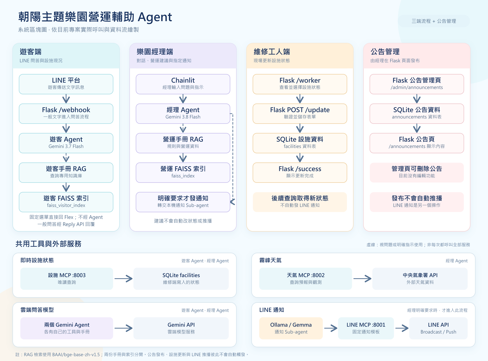

# 朝陽主題樂園營運輔助 Agent

本專案把**遊客 LINE 客服、經理營運決策與維修人員設施管理**串接在同一套樂園流程中。遊客與經理各自使用獨立手冊做 RAG 檢索；Gemini 負責問答與分析，本機 Ollama／Gemma 參與經理指定的固定類型 LINE 通知。經理從公告管理頁發布公告時，系統另會嘗試同步發送 LINE 文字廣播。

## 功能一覽

| 使用者   | 入口              | 目前功能                                                                             |
| -------- | ----------------- | ------------------------------------------------------------------------------------ |
| 遊客     | LINE 官方帳號     | 固定選單、遊客手冊問答、查詢設施現況；提示詞要求無可靠答案時依問題類型轉介。         |
| 樂園經理 | Chainlit 對話介面 | 查詢霧峰天氣、設施狀態及營運手冊，取得營運建議；明確要求後發送固定類型的 LINE 通知。 |
| 維修人員 | Flask `/worker`   | 查看設施清單，將狀態更新為正常開放、暫停開放或設施維修中。                           |
| 樂園經理 | Flask 公告管理頁  | 新增、查看及刪除公告；發布時嘗試同步廣播 LINE 文字訊息，目前不能編輯公告。           |

維修更新後，遊客與經理的**後續查詢**才會讀到新狀態。營運建議不會自動更改設施，也不會自動發送經理對話中的天氣／維修通知；但**公告管理頁送出公告會嘗試立即廣播 LINE 文字訊息**。這兩種通知流程不同。

## 功能介紹

### 遊客端：LINE 智慧客服

遊客可從 LINE 選單查看營運時間、優惠、樂園及交通資訊，或直接輸入票務、入園規則等問題。一般文字問題由 Gemini 參考**遊客專用手冊**回答；詢問設施目前是否開放時，可透過設施 MCP 讀取資料庫現況。客服不使用經理的營運手冊，也不能單憑一般營業時間保證今日一定開園。沒有可靠資料時，提示詞要求依問題引導遊客查看公告、使用「聯絡我們」或尋求現場協助。

### 經理端：營運查詢、建議與指定通知

經理在 Chainlit 對話中可分別查詢霧峰天氣、設施現況與**營運手冊**規則，也可要求結合這三種資料提出目前營運建議。建議僅供經理判斷，不會自行變更設施狀態或發送通知。若經理明確要求發送指定類型的通知，主 Agent 才會交由本機 Ollama／Gemma Sub-agent 使用 LINE MCP 發送固定的天氣或維修通知；不能由對話自由撰寫任意通知內容。

### 維修端：設施狀態維護

維修人員在 `/worker` 查看設施清單，將各設施設為「正常開放」、「暫停開放」或「設施維修中」，按儲存後寫入 SQLite。遊客客服及經理端的**後續設施查詢**會讀到更新後的資料；此操作本身不會發送 LINE 通知。

### 公告管理：發布、查閱與刪除

經理在 `/admin/announcements` 填寫標題與內容，系統帶入發布時間與發布人。按「發布公告」後，程式先保存到 SQLite，再嘗試向 LINE 官方帳號好友廣播公告文字；`/announcements` 顯示公告列表。公告可刪除但不能直接編輯；**刪除公告不會撤回已發出的 LINE 訊息**。這是公告頁的流程，不等同於 Chainlit 對話中經理指定的固定通知。

## 模型配置

| 用途                      | 目前程式設定            | 執行位置          |
| ------------------------- | ----------------------- | ----------------- |
| 經理營運 Agent            | `gemini-3.8-flash`      | Google Gemini API |
| 遊客 LINE 問答 Agent      | `gemini-3.7-flash`      | Google Gemini API |
| 經理通知用 LINE Sub-agent | `gemma4:e2b`            | 本機 Ollama       |
| 兩份 RAG 的向量模型       | `BAAI/bge-base-zh-v1.5` | CPU               |

以上依目前原始碼記錄；修改模型名稱時，請同步確認 Google API 或 Ollama 端可使用該模型。

## 目前開發環境

- 作業系統：Windows 11
- CPU：Intel Core i5-12600K
- GPU：NVIDIA GeForce RTX 4060 Ti 8 GB
- RAM：32 GB
- Python：3.12

這是目前使用的主機配置，不是最低硬體需求；兩份 RAG 的 BGE 向量模型在程式中指定使用 CPU。

## 安裝方式

以下以 Windows PowerShell 為例，所有指令都必須在專案根目錄執行。專案依賴版本固定於 `requirements.txt`，預期使用 Python 3.12。

### 1. 安裝必要軟體

請依使用的功能安裝：

- [Python 3.12](https://www.python.org/downloads/)
- [Ollama for Windows](https://ollama.com/download/windows)（僅經理通知用 LINE Sub-agent 需要）
- Git（如需使用 Git 下載專案）

安裝 Python 時，請勾選將 Python 加入 PATH；只有在使用經理營運 Agent 的 LINE 通知功能時才需要 Ollama。

### 2. 建立虛擬環境

```powershell
py -3.12 -m venv .venv
.\.venv\Scripts\Activate.ps1
python -m pip install --upgrade pip
python -m pip install -r requirements.txt
```

若 PowerShell 不允許執行啟用腳本，可改用 CMD 的 `.venv\Scripts\activate.bat`，或直接呼叫 `.venv\Scripts\python.exe`。若既有 `.venv` 從其他路徑搬移而來，或原本的 Python 已被移除，請重建虛擬環境；虛擬環境不能視為可直接搬移的資料夾。

### 3. 準備 Ollama 模型

若要使用經理營運 Agent 的通知功能，確認 Ollama 已在背景執行，並準備 LINE Sub-agent 使用的模型：

```powershell
ollama pull gemma4:e2b
```

可使用下列指令確認模型是否存在：

```powershell
ollama list
```

若 Ollama 沒有自動啟動，可另外開啟一個終端機執行：

```powershell
ollama serve
```

### 4. 設定環境變數

在專案根目錄建立 `.env`，內容如下：

```env
# 經理營運 Agent 與遊客 LINE 問答 Agent 共用
GOOGLE_API_KEY=填入_Google_API_Key

# 中央氣象署開放資料平台
Weather_API_KEY=填入_CWA_API_Key

# 回覆 LINE Webhook、公告文字廣播及經理指定的遊客通知
CHANNEL_ACCESS_TOKEN=填入_LINE_Channel_Access_Token

# 發送維修通知
WORKER_LINE_USER_ID=填入_維修人員_LINE_User_ID
WORKER_CHANNEL_ACCESS_TOKEN=填入_維修頻道_Channel_Access_Token
```

只使用遊客 LINE 客服時，至少需要 `GOOGLE_API_KEY` 與 `CHANNEL_ACCESS_TOKEN`；完整營運功能還需要天氣 API 金鑰與維修通知設定。變數名稱有大小寫之分，請保持與範例完全一致。`.env` 已列入 `.gitignore`，請勿將真實金鑰或 Token 提交到版本控制。

### 5. 確認兩份獨立的 RAG 手冊

目前使用 `InMemoryVectorStore`，向量模型均為 CPU 上的 `BAAI/bge-base-zh-v1.5`。兩份手冊及 JSON 快取互不共用：

| 用途         | Markdown 來源               | 本機索引快取                     | 載入它的服務     |
| ------------ | --------------------------- | -------------------------------- | ---------------- |
| 經理營運規則 | `樂園營運手冊.md`           | `vector_indexes/operations.json` | Chainlit         |
| 遊客常見問題 | `朝陽樂園遊客知識庫手冊.md` | `vector_indexes/visitor.json`    | Flask／LINE 客服 |

兩份手冊都先依 Markdown 標題分段，再對較長段落的正文使用 `chunk_size=350`、`chunk_overlap=60`（單位為字元）；標題會另外加回每個 chunk，不使用 `AutoTokenizer` 計算 token 長度。Overlap 僅限同一標題段落內，不跨營運章節或不同 FAQ。遊客 FAQ 若短於 chunk 大小，就仍是一題一段，不會實際產生 overlap。

`ai/tools.py` 與 `ai/qa_tool.py` 會在**模組匯入時**分別載入營運、遊客索引；快取不存在時才切分手冊、產生 embedding，並把向量存成 JSON。首次啟動也可能下載 BGE 模型。索引存在時直接載入，不會因 Markdown 修改而自動更新；**修改手冊或切分設定後，先停止對應服務、只刪除該手冊的 JSON 快取，再重啟服務**。例如修改遊客 FAQ，只刪 `vector_indexes/visitor.json` 並重啟 Flask；修改營運手冊，只刪 `vector_indexes/operations.json` 並重啟 Chainlit。

`vector_indexes/` 已列入 `.gitignore`，新環境會由手冊自行建立索引；請勿把本機快取當作應提交的原始資料。

## 啟動服務

所有服務都從專案根目錄啟動，且各自佔用一個終端機。每個 PowerShell 視窗先執行 `.\.venv\Scripts\Activate.ps1`（或直接使用 `.venv\Scripts\python.exe` 取代下列 `python`）。

### 只啟動遊客 LINE 客服

依序啟動：

1. `python server.py`：Flask Webhook 與 SQLite 初始化，預設 port 5000。
2. `python -m mcp_servers.get_facility_status`：設施狀態 MCP，port 8003。

目前遊客 Agent 在處理**一般文字問題**時就會連接設施 MCP 取得工具，因此即使只問票務，也要先啟動 8003。固定選單與加入好友歡迎訊息不會建立遊客 Agent。這條流程不需要 Ollama、Weather MCP、LINE 通知 MCP 或 Chainlit。

### 啟動完整營運系統

除上述 Flask 與設施 MCP 外，另開終端機啟動下列服務；全部就緒後再開 Chainlit：

| 服務          | 指令                                | Port／用途               |
| ------------- | ----------------------------------- | ------------------------ |
| Ollama        | `ollama serve`（若尚未在背景執行）  | 經理通知用 Gemma 模型    |
| LINE 通知 MCP | `python -m mcp_servers.line_notify` | 8001；遊客廣播與維修通知 |
| Weather MCP   | `python -m mcp_servers.weather`     | 8002；中央氣象署資料     |
| Chainlit      | `python -m chainlit run app.py`     | 8000；經理營運對話       |

Chainlit 在對話開始時建立經理 Agent，會連接 8001、8002、8003 三個 MCP 服務。只開 Chainlit、不開 Flask 也可以進行營運對話，但請先確保 SQLite 資料表已由 `server.py` 初始化過。

## 服務網址

| 服務                | 本機網址                                    | 說明                       |
| ------------------- | ------------------------------------------- | -------------------------- |
| 介紹首頁            | `http://127.0.0.1:5000/`                    | 一頁式三端功能介紹         |
| Chainlit            | `http://127.0.0.1:8000`                     | 經理營運對話介面           |
| 設施管理            | `http://127.0.0.1:5000/worker`              | 查看及修改設施狀態         |
| 公告管理            | `http://127.0.0.1:5000/admin/announcements` | 建立與刪除公告             |
| 公告列表            | `http://127.0.0.1:5000/announcements`       | 查看已發布公告             |
| LINE Webhook        | `http://127.0.0.1:5000/webhook`             | 接收 LINE 事件的 POST 端點 |
| LINE 通知 MCP       | `http://127.0.0.1:8001/mcp`                 | 天氣廣播、維修通知         |
| Weather MCP         | `http://127.0.0.1:8002/mcp`                 | 天氣資料                   |
| Facility Status MCP | `http://127.0.0.1:8003/mcp`                 | SQLite 設施狀態            |

LINE 平台無法存取電腦上的 `127.0.0.1`。要接收真實 LINE Webhook，需透過 ngrok 等 HTTPS 通道公開 **Flask 的 port 5000**，並把公開網址加上 `/webhook` 設定到 LINE Developers Console。只在瀏覽器開啟本機網址，不會自行收到 LINE 訊息；專案內沒有提供 ngrok 設定檔。**公開 Webhook 不會自動改寫 Flex 訊息內的連結**，對外發送前須另外檢查那些連結是否可由手機開啟。

## 使用方法

以下操作以前述服務已啟動為前提。LINE 正式收訊還需要把 Flask Webhook 設為可由 LINE 存取的 HTTPS 網址。

### 遊客：查詢園區資訊

1. 在 LINE 官方帳號使用選單的「查看今日營運時間」、「查看最新優惠活動」、「查看樂園資訊」、「查看完整交通資訊」或「聯絡我們」。這些固定指令直接回覆 Flex 訊息，不經遊客 Agent。
2. 直接輸入問題，例如「票價是多少？」或「急流泛舟目前開放嗎？」。一般文字問題會交給 Gemini、遊客手冊與設施查詢工具處理；LINE 一對一聊天室會先嘗試顯示載入動畫。
3. 若詢問今日開園或設施恢復時間，但沒有可確認的當日資料，依客服回覆查看公告消息或聯繫園方，不把一般營業時間當作當日保證。

### 經理：查詢、取得建議、發送固定通知

1. 開啟 `http://127.0.0.1:8000`，在對話框輸入單一問題，例如「現在霧峰的天氣如何？」、「目前有哪些設施維修中？」或「如果下大雨，依營運手冊應如何處理？」。
2. 若要綜合分析，輸入「根據目前天氣與設施狀態，給我營運建議。」並核對回答所依據的現場情況。對話回答不會改變資料庫中的設施狀態。
3. 確認需要通知後，另行明確輸入「發送大雨通知」或「發送維修通知」，並檢查工具回覆是否成功。遊客天氣通知會向 LINE 好友廣播；維修通知送給指定維修人員。完整經理端教學見 [chainlit.md](chainlit.md)。

### 維修人員：更新設施狀態

1. 開啟 `http://127.0.0.1:5000/worker`，查看每項設施目前狀態。
2. 在需調整的設施旁選擇「正常開放」、「暫停開放」或「設施維修中」，按「儲存設施狀態」。
3. 確認成功頁：之後再由遊客或經理端查詢設施，才會取得更新後的狀態。儲存本身不會推播 LINE。

### 經理：發布公告

1. 開啟 `http://127.0.0.1:5000/admin/announcements`，填寫標題與內容。**按「發布公告」會立即嘗試發送 LINE 文字廣播**，送出前須確認內容和收件對象。
2. 查看頁面顯示的是「公告已成功發布，並已同步發送 LINE 廣播訊息」，還是「公告已成功發布，但 LINE 廣播訊息發送失敗」；再按「查看公告頁」並到 LINE 核對。若請求中途出錯，也要先檢查公告是否已保存，避免重複發布。
3. 誤發時可在管理頁刪除公告；目前沒有編輯功能，且刪除**不會撤回**已送出的 LINE 廣播。Chainlit 對話不能代替這個公告發布操作。

## 基本驗證

安裝完成後，可先執行 `python -m pip check` 確認目前虛擬環境沒有套件相依衝突。啟動 Flask 後，依序查看首頁、`/worker` 和 `/admin/announcements` 是否能顯示；再啟動三個 MCP 與 Chainlit，分別測試遊客與經理手冊、天氣和設施問題。確認兩份 JSON 索引已分別建立。公告發布會真的呼叫 LINE 廣播 API，測試時請使用適當的測試帳號及公告內容，勿把測試文案發給正式遊客。

## 專案目錄

```text
CYUT_PARK_AGENT\
├─ ai\                  # 經理 Agent、遊客 Agent、通知 Sub-agent、各自工具與提示詞
├─ db\                  # SQLite 初始化與資料存取；執行後產生 cyut_park.db
├─ Line_template\       # 固定選單與通知的 Flex Message JSON
├─ mcp_client\          # 三個 MCP 服務的連線設定
├─ mcp_servers\         # LINE 通知、天氣、設施狀態 MCP
├─ rag\                 # 兩份手冊的切分、Embedding 與 InMemoryVectorStore 載入
├─ routes\              # Flask Webhook、設施與公告路由
├─ services\            # LINE Reply API 呼叫
├─ static\              # Flask 頁面的 CSS、圖片與 JavaScript
├─ templates\           # Flask HTML 模板
├─ app.py               # Chainlit 經理介面
├─ server.py            # Flask 與資料庫初始化入口
├─ config.py            # 路徑、時區與環境變數
├─ requirements.txt     # 固定的 Python 依賴版本
├─ chainlit.md          # 經理端新手教學
├─ 專案工作流程.md       # 既有流程筆記；索引與公告段落待同步
├─ 系統區塊圖.md         # Mermaid 系統圖；索引與公告段落待同步
├─ 系統架構圖.png        # 系統圖圖片版；應與現行程式重新核對
├─ 樂園營運手冊.md       # 經理 RAG 知識來源
└─ 朝陽樂園遊客知識庫手冊.md  # 遊客 RAG 知識來源
```

## 常見問題

### `ModuleNotFoundError: No module named 'config'`

請確認目前目錄是專案根目錄，並使用模組方式啟動 MCP Server：

```powershell
python -m mcp_servers.weather
```

不要先切換到 `mcp_servers` 後執行 `python weather.py`，否則 Python 可能找不到根目錄的 `config.py`。

### Chainlit 啟動或開始對話時顯示連線失敗

經理 Agent 在對話開始時會連接三個 MCP Server。請確認 8001、8002、8003 都已啟動，且 `mcp_client/mcp_client.py` 中的網址沒有被修改。遊客 LINE 問答目前則需要 8003。

### Flask 啟動時 BGE 模型載入訊息出現兩次

`server.py` 使用 Flask 開發模式的重新載入器，可能讓匯入階段的遊客向量模型載入兩次。若程式最後正常顯示 `Running on http://127.0.0.1:5000`，這通常不是啟動失敗；若要排查卡住或記憶體使用量，請先確認索引與模型載入是否完成。

### `ollama` 不是內部或外部命令

請安裝 Ollama，重新開啟終端機，再執行 `ollama --version`。若仍無法使用，請確認 Ollama 已加入系統 PATH。

### Ollama 顯示找不到 `gemma4:e2b`

```powershell
ollama pull gemma4:e2b
```

### Google API 回傳錯誤

確認 `.env` 的 `GOOGLE_API_KEY`、目前程式指定的 Gemini 模型 ID，以及 Gemini API 的錯誤碼與訊息。暫時性伺服器錯誤可稍後重試；不要只憑 HTTP 500 判定 API Key 有效或無效。

### 修改手冊後仍取得舊內容

修改 Markdown 不會自動更新已載入的索引。請先停止對應服務，刪除 `vector_indexes/operations.json` 或 `vector_indexes/visitor.json` 中**對應的一個檔案**，再重啟 Chainlit 或 Flask。不要刪除另一份手冊的索引，也不要期待刪除舊 FAISS 資料夾能重建目前的 InMemoryVectorStore。

## 系統架構圖


